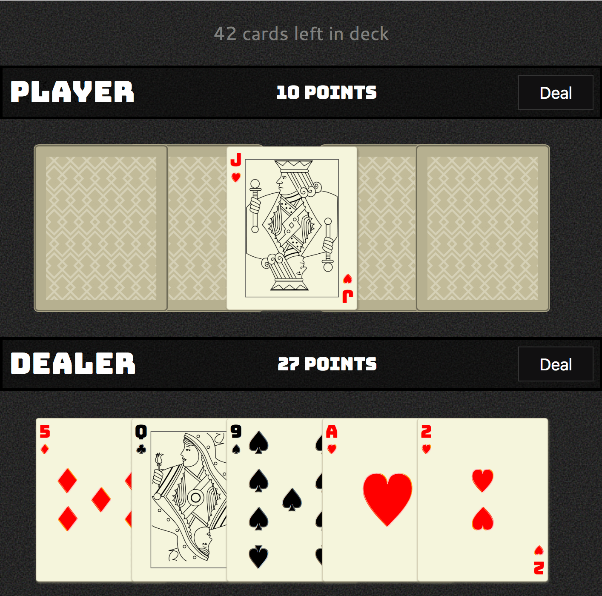

# Card game
* card game in react

## Overview
* Click begin to start a new game. This sets the number of cards to start the game.
* The dealer's cards are face up.
* The dealer's & players dealt cards are face down.
* Dealer or player may to flip over each card to display it's value.
* Dealer's or player's points display for visible cards only.

## Screenshot

